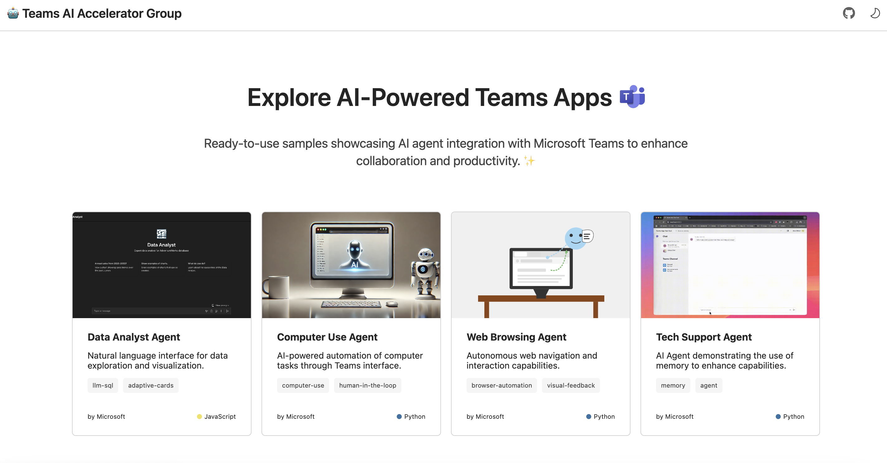

# Teams AI Accelerator Gallery

A sample gallery showcasing AI-powered Teams applications built by the Teams AI Accelerator Group.



## Overview

This gallery is built with:

- [Next.js 15](https://nextjs.org/) (Static Export)
- [React 8](https://react.dev/)
- [Fluent UI](https://react.fluentui.dev/)
- [Node.js 20](https://nodejs.org/)
- [npm](https://www.npmjs.com/)

The gallery provides a curated collection of Teams app samples that developers can use as starting points for building their own AI-powered Teams applications. Each sample includes:

- Source code and documentation
- Live demo
- Implementation details
- Key features
- Setup instructions

## Features

- 🎨 Modern, responsive UI built with Fluent UI components
- 🌗 Light/dark theme support
- 📱 Mobile-friendly design
- 📖 Detailed sample documentation
- 🚀 Link to Github project

## Getting Started

First, run the development server:

```bash
npm run dev
```

Open [http://localhost:3000](http://localhost:3000) with your browser to see the result.

## Production

### Build

To create static export build to `out/` folder, run:

```bash
npm run build
```

> Next.js [static export](https://nextjs.org/docs/pages/building-your-application/deploying/static-exports) builds the
> application into HTML, CSS, JS, and static assets that can be deployed as a static page. Hence features like
> Server-side rendering, Dynamic routes, and many more do not work. The local development server support these features
> and so it is possible to introduce code changes that work locally but will failed on static export build.

### Testing in Github Pages

First create a fork of this repo. Then enable Github Actions and Github Pages in the repository settings. Run the `Deploy Next.js site to Pages` workflow to deploy to Github Pages. Once testing is done in your forked repository, you can create a PR to merge it into the source repository. Ensure that the `Build with Next.js` workflow runs for the page to successfully deploy.

## Other commands

### Linter

```bash
npm run lint
```

### Format using Prettier

```bash
npm run format
```

## Samples

Samples in the gallery are loaded from the [frontmatter](https://frontmatter.codes/) of each samples' README file.

For example the Front Matter in the `Data Analyst Agent`'s README file:

```md
---
id: data-analyst-agent
title: 'Data Analyst Agent'
description: 'Natural language interface for data exploration and visualization.'
longDescription: ...
featuresList:
  - '🔍 Query databases using natural language'
  - '📊 Generate visualizations using Adaptive Cards from query results'
  - '📈 Analyze data patterns and trends'
  - "🔄 'reset' command to clear the conversation history."
tags:
  - 'llm-sql'
  - 'adaptive-cards'
  - 'data-viz'
githubUrl: ...
imageUrl: '/data-analyst-thumbnail.png'
author: 'Microsoft'
language: 'JavaScript'
demoUrlGif: ...
---

# Data Analyst Agent for Microsoft Teams

This sample demonstrates....
```

Each sample in `samples.yaml` has the following fields:

- `id`: Unique identifier for the sample
- `title`: Display name of the sample
- `description`: Short summary of the sample's functionality
- `longDescription`: Detailed description of sample's functionality. Supports markdown links and bold syntax.
- `featuresList`: Array of key features with emoji icons
- `tags`: Array of relevant technology/feature tags
- `githubUrl`: Link to the sample's source code repository
- `imageUrl`: Path to the sample's thumbnail image
- `author`: Creator/maintainer of the sample
- `language`: Primary programming language used
- `demoUrlGif`: URL to an animated GIF demonstrating the sample

### How to add a sample to the gallery?

1. Add front matter content following the above format to the top of a README file.

2. Update the [frontmatter.json](../frontmatter.json) config file by adding a new object to the `"frontMatter.content.pageFolders"` list.

The object will look like this:

```json
{
  "path": "[[workspace]]/python/memory-sample-agent",
  "title": "memory-sample-agent"
}
```

The `path` should point to the folder that contains the `README.md` file.

3. Once that is done follow instructions in the [Testing In Github Pages](#testing-in-github-pages) section to test your changes.

## Appendix

### Caveats

- When using `Image` component, make sure the prefix the `src` with the `basePath` from `next.config.ts` so that the images are served from the correct path.

  ```tsx
  import config from 'path/to/next.config';

  <Image src={`${config.basePath}/next.svg`} />;
  ```

- The following issue occurs when using the `FluentProvider` for which there's a hacky solution. However it is not affecting the production static build nor the performance of the site. Hence we're ignoring it for now. It will show up as a console error in the dev environment though.

  ```
  @fluentui/react-provider: There are conflicting ids in your DOM. Please make sure that you configured your application properly.

  Configuration guide: https://aka.ms/fluentui-conflicting-ids
  ```
