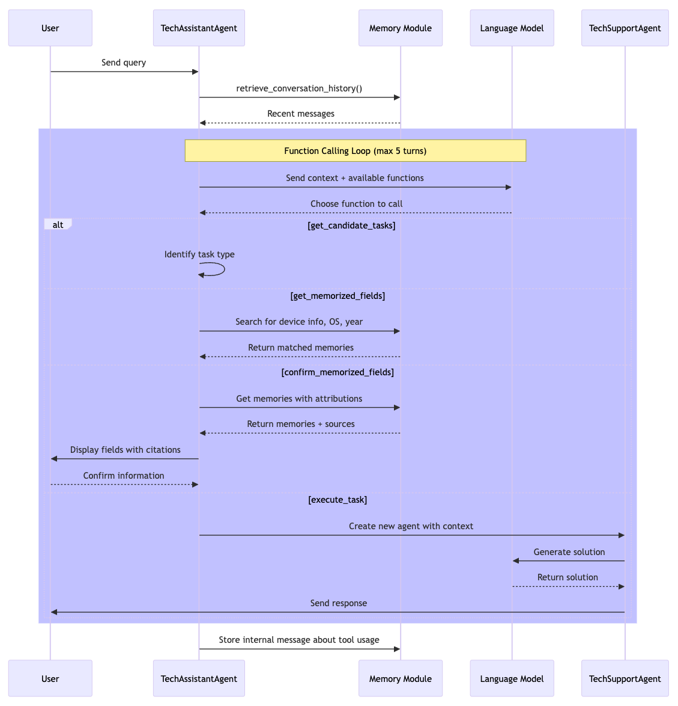
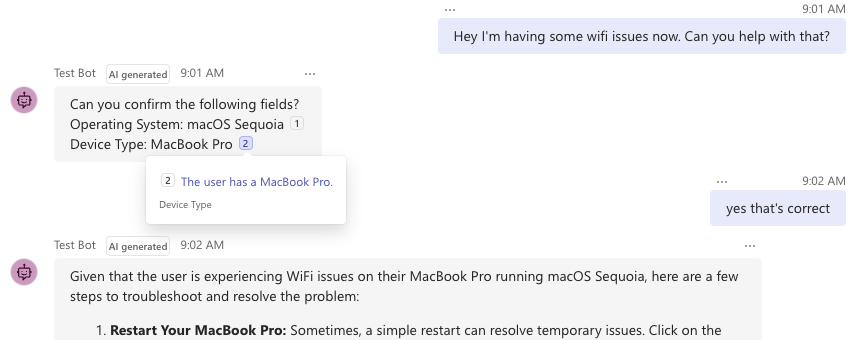
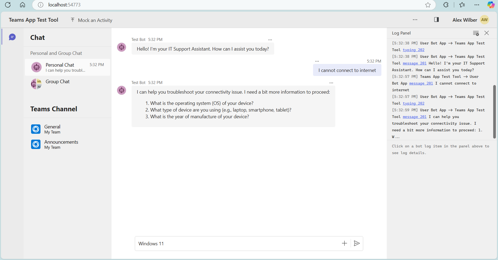

# 🧠 Tech Support Assistant with Memory

This sample showcases a powerful Tech Support Assistant that remembers your device details and past issues, eliminating the frustration of repeating yourself. By leveraging Semantic Memories, this agent delivers a more personalized and efficient support experience. It shocases using the [Memory Module](https://github.com/microsoft/teams-agent-accelerator-libs-py/tree/main/packages/teams_memory) to extract semantic memories from the user's messages and use them to answer questions more efficiently.


_An initial example with the tech support assistant._


_A followup example with the tech support assistant using memory to answer questions more efficiently._

## ✨ Key Features at a Glance

- **Remembers your device details** - No more repeating your device type, OS, or year
- **Personalized support experience** - Conversations that feel continuous, not disconnected
- **Efficient problem-solving** - Faster resolutions by building on past interactions
- **Seamless memory integration** - Demonstrates practical implementation of memory in AI assistants

See [tech_assistant_agent](./tech_assistant_agent/README.md) for more details on the tech support assistant agent. Its [prompts](./tech_assistant_agent/prompts.py) are especially helpful to understand how this agent works.

## 🤔 Why is Memory a Game-Changer?

Adding memory to an agent has a number of benefits:

- **Contextual Understanding**: Memory allows agents to maintain a context of previous interactions, enabling them to make more informed decisions and provide more accurate responses. It reduces the need to supply and rehydrate the context from scratch as was necessary for traditional chatbots.
- **Simpler interactions**: Memory allows agents to remember information about the user, such as their name, preferences, and history, leading to more personalized and engaging experiences.
  In this sample, the agent can remember the user's device type, operating system, and device year so they don't have to ask for it every time.
- **Enhanced User Experience**: Memory helps agents remember user preferences and history, leading to a more personalized and engaging experience.

## 🔍 How Does It Work?

### Basic Architecture



In this sample, the agent is given access to the memory module as an explicit tool call to retrieve semantic memories if needed. The working memory on the other hand is fetched before the functional loop begins.

> [!NOTE]
> The memory extraction happens in the background whenever messages are received by the agent, or sent by the agent.

### 🧩 Key Components Explained

#### 1️⃣ Topics: What the Agent Remembers

The sample is initialized with a list of topics that it cares about. These are topics that the agent wants to remember about the user. Specifically, they are:

1. Device Type
2. Operating System
3. Device Year

See [tools.py](./tech_assistant_agent/tools.py) for the definition of the topics.

#### 2️⃣ Middleware: The Memory Recorder

When you initialize the `MemoryMiddleware`, it will start to record all the messages that are incoming or outgoing from the bot. These messages are then used by the agent as working memory and also for extraction for long term memory.

By setting up the middleware we also get access to a scoped version of the `memory_module` from the TurnContext. This memory module is scoped to the conversation that the TurnContext is built for.

See [bot.py](./bot.py) for the initialization of the `MemoryMiddleware`.

> [!TIP]
> You'll notice that for the sample, the `timeout_seconds` is 60 seconds. The extraction here is set to be a bit aggressive (extract every 1 minute if there is a message in a conversation) to demonstrate memory extraction, but a higher threshold here is reasonable to set here.

#### 3️⃣ Automatic Extraction: Memory Formation

The Memory Module can be set up to automatically extract long term memories from the working memory. When the application server starts up, by calling `memory_middleware.memory_module.listen()`, it will start to trigger extraction of memories in depending on the configuration passed when the `MemoryMiddleware` (or `MemoryModule`) was initialized. This work happens in a background thread and is non-blocking.
See [app.py](./app.py) for the initialization of the `MemoryMiddleware`. Note that when `listen` is called, you also should call `shutdown` when the application is shutting down.

> [!NOTE]
> The alternative to automatic extraction is explicit extraction. This can be accomplished by calling `memory_module.process_messages` which will process all the messages that are in the message buffer. Check out the [Memory Module](https://github.com/microsoft/teams-agent-accelerator-libs-py/tree/main/packages/teams_memory) for more details.


#### 4️⃣ Working Memory: Short-term Recall

The agent can use the conversational messages as working memory to build up contexts for LLM calls for the agent. In addition to the incoming and outgoing messages, the agent can also add internal messages to the working memory.

See [primary_agent.py](./tech_assistant_agent/primary_agent.py) for how working memory is used, and also how internal messages are added to the working memory.

> [!NOTE]
> To demonstrate long term memory, the working memory only takes the last 1 minute of messages. Feel free to configure this to be longer. See [primary_agent.py](./tech_assistant_agent/primary_agent.py) for the configuration.

#### 5️⃣ Long-term Semantic Memories: Deep Knowledge

The tech support assistant can search for memories from a tool call (See [get_memorized_fields](./tech_assistant_agent/tools.py)). In this tool call, the agent searches memories for a given topic. Depending on if the memories are found or not, the agent can then continue to ask the user for the information or proceed with the flow (like confirming the memories).

This usage of memory is _explicit_ as it requires the LLM to _explicitly_ seek memories via a tool call. Another approach is to use _implicit_ memory. In this case, similar to working memory, the application could automatically search for memories that it deems as always necessary to the task and include it in the system prompt. The search in this case could be done for a particular topic or query.

#### 6️⃣ Citing Memories: Building Trust

If the agent finds memories that are relevant to the task at-hand, the tech support assistant can ask for confirmations of the memories and cite the original sources of the memories.



See [confirm_memorized_fields](./tech_assistant_agent/tools.py) for the implementation of the tool call.

## 🚀 Running the Sample

### Get started with the sample

> **Prerequisites**
>
> To run the template in your local dev machine, you will need:
>
> - [Python](https://www.python.org/), version 3.8 to 3.11.
> - [Python extension](https://code.visualstudio.com/docs/languages/python), version v2024.0.1 or higher.
> - [Teams Toolkit Visual Studio Code Extension](https://aka.ms/teams-toolkit) latest version or [Teams Toolkit CLI](https://aka.ms/teams-toolkit-cli).
> - An account with [OpenAI](https://platform.openai.com/).
> - [Node.js](https://nodejs.org/) (supported versions: 16, 18) for local debug in Test Tool.

### Configurations

1. create _.env_ in root folder. Copy the below template into it.

```
# AZURE CONFIG

AZURE_OPENAI_API_KEY=<API key>
AZURE_OPENAI_DEPLOYMENT=gpt-4o
AZURE_OPENAI_EMBEDDING_DEPLOYMENT=text-embedding-3-small
AZURE_OPENAI_API_BASE=https://<domain name>.openai.azure.com
AZURE_OPENAI_API_VERSION=<version number>

# OPENAI CONFIG

OPENAI_MODEL_NAME=gpt-4o
OPENAI_API_KEY=<API key>
OPENAI_EMBEDDING_MODEL_NAME=text-embedding-3-small
```

Remember, that these are also used by the Memory Module to extract and retrieve memories.

Fill out only one of Azure OpenAI and OpenAI configurations.

### Debug with Teams Test Tool

1. Open a new terminal under root folder.
1. run `npm install -g @microsoft/teamsapp-cli`
1. run `uv sync`
1. run `.venv\Scripts\Activate`
1. run `python src/app.py`  
   If success, server will start on `http://localhost:3978`
1. Open another new Terminal under root folder
1. Install the teams app test tool (if you haven't already done that)
   - run `mkdir -p src/devTool/teamsapptester` (or `New-Item -ItemType Directory -Path src/devTool/teamsapptester -Force` on Powershell)
   - run `npm i @microsoft/teams-app-test-tool --prefix "src/devTools/teamsapptester"`
1. run `node src/devTools/teamsapptester/node_modules/@microsoft/teams-app-test-tool/cli.js start`  
   If success, a test website will show up
   

### Debug in Teams

1. Open a new terminal under root folder.
1. run `uv sync`
1. run `.venv\Scripts\Activate`
1. Open this folder as a VSCode workspace.
1. Navigate to the `Run and Debug` tab in VSCode, and select `Debug in Teams (Edge)`. This will start the flow to sideload the bot into Teams, start the server locally, and start the tunnel that exposes the server to the web.

### Deploy to Azure

Currently the scaffolding only supports Azure OpenAI related configurations but can be easily update to support OpenAI configuration.

1. Open a new terminal under root folder.
1. run `uv sync`
1. run `.venv\Scripts\Activate`
1. Build the memory module into a distribtuion file by doing `uv build packages/teams_memory`. This should create the artifact `dist/teams_memory-0.1.0.tar.gz`. Copy this into the `src/dist/` folder.
1. Open this folder as a VSCode workspace.
1. Copy the contents of the `.env` file and add it to the `env/.env.dev.user` file.
1. Navigate to the Teams Toolkit extension in VSCode.
1. Under `Lifecycle`, first click `Provision` to provision resources to Azure.
1. Then click `Deploy`, this should deploy the project to the Azure App Service instance, and run the start up script.
1. If the above two steps completed successfully, then click `Publish`. This will create an app package in `./appPackage/build/appPackage.dev.zip`.
1. Sideload the app package in Teams and start chatting with the bot.

**Congratulations**! 🎉 You are running an application that can now interact with users in Teams:
